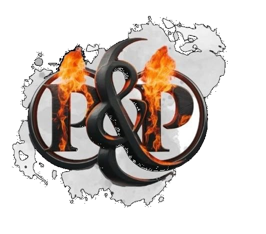

  

# Volo's Guide to P&P

*Benvenuti, avventurieri e curiosi!*

Questa è la cronaca della campagna dei **Permalosi & Polemici** (P&P), un gruppo di avventurieri — e persone — che da anni popola le nostre serate di dadi, risate e colpi di scena.

[Scopri chi siamo →](/chi-siamo/)

Qui troverete:

- 🧙 **Personaggi** — chi sono, da dove vengono, cosa sanno fare
- 🏰 **Lore** — città, regioni, storia del mondo
- ⚔️ **Fazioni** — gilde, ordini, poteri in gioco
- 🎭 **PNG** — le facce che incontrate
- 📜 **Missioni** — archi narrativi, quest completate e in sospeso
- 📝 **Sessioni** — riassunti di ogni incontro

---

> *"Non tutto ciò che è oro riluce, non tutto ciò che vaga è perduto."*
> — J.R.R. Tolkien, *Il Signore degli Anelli*

[//]: # (Citazione d'atmosfera — sostituibile con un motto della campagna se ne avete uno)