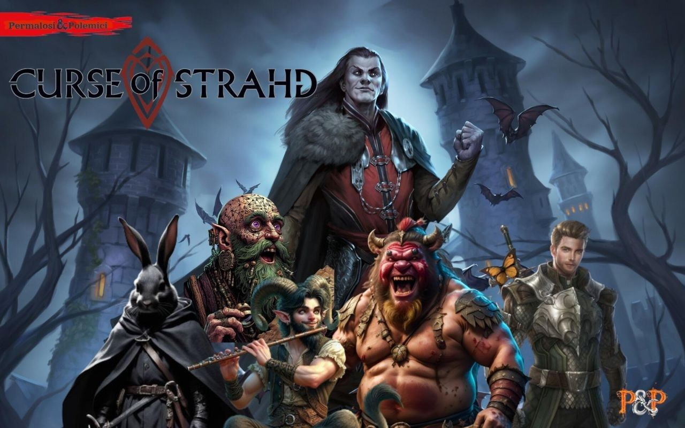

# Personaggi Giocanti

I personaggi dei Permalosi & Polemici, divisi per campagna.

---

## Vecna: Eve of Ruin

La campagna in corso.

- [Asha](vecna/asha.md) — Tiefling Arcane Archer 7 / Monster Slayer 3, guardia di Neverwinter
- [Karesh "Brightscale" Jenrath](vecna/karesh.md) — Dragonide Paladino 10 (Oath of the Watchers), guardia di Neverwinter
- [Kobrut](vecna/kobrut.md) — Kobold Psi Warrior Fighter 10, principe spodestato
- [Astorio Wisewind](vecna/astorio.md) — Umano Divination Wizard 10, mago consulente di Neverwinter

---

## Curse of Strahd

La campagna conclusa. Personaggi che hanno affrontato l'orrore di Barovia.

- [Lûth Aen Elentir](strahd/luth-aen-elentir.md) — Harengon Rogue 1 / Gloom Stalker Ranger 4 / Battle Master Fighter 5, coniglio cresciuto al Circo del Witchlight
- [Nezuko](strahd/nezuko.md) — Bugbear Path of the Beast Barbarian 10, ex-barbaro dal cuore dolce diventato uomo forzuto del circo
- [Slap](strahd/slap.md) — Satyr College of Spirits Bard 10, bardo satiro alcolizzato e ossessionato dalle umane
- [Randal](strahd/randal.md) — Variant Human Life Domain Cleric 10, guaritore e servo di Pelor
- [Laszlo Morel](strahd/laszlo.md) — Hexblood Circle of Stars Druid 10, astrologo e divinatore, in realtà una strega del Feywild
- [Radagast il Magnifico](strahd/radagast.md) — Variant Human Divine Soul Sorcerer 6, il Folle di Dio, artista e guaritore del circo