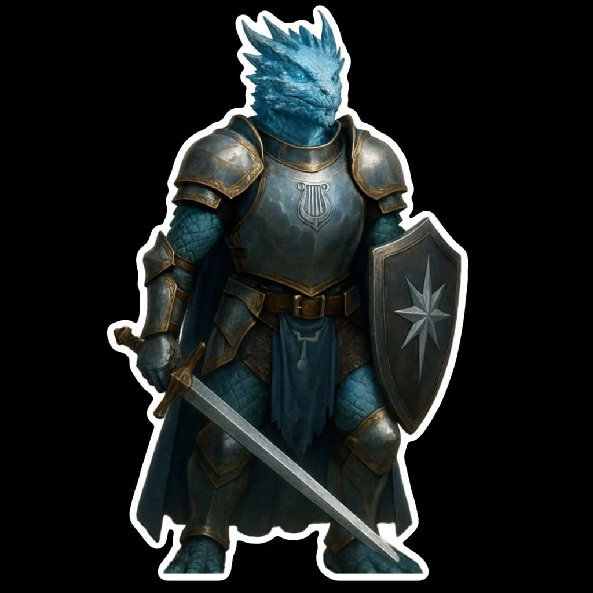

{: .portrait }

# Karesh "Brightscale" Jenrath

> *Dragonide (Gem Crystal) Paladino 10 — Oath of the Watchers, Guardia di Neverwinter*

---

## Background

Nato nelle periferie di **Neverwinter** da una piccola comunità di dragonidi, Karesh "Brightscale" Jenrath è sempre stato visto come "diverso", quasi etereo: le sue scaglie traslucide riflettevano la luce come cristallo puro, e fin da giovane percepiva suoni e vibrazioni che gli altri non sentivano, eco della sua eredità psionica.

Cresciuto in tempi instabili, scelse presto la via delle armi: prima come recluta tra le fila delle milizie cittadine, poi come soldato semplice assegnato alla guardia delle mura e alle pattuglie urbane. Nonostante l'inizio umile, mostrò disciplina, sangue freddo e un innato senso del dovere, qualità che gli valsero il grado di **sottufficiale**.

### L'Incidente al Magazzino

Durante una notte di ronda, la sua pattuglia venne inviata a verificare strani fenomeni luminosi apparsi nei pressi di un vecchio magazzino abbandonato nel **Distretto dei Fabbri**. Quando entrarono, trovarono all'interno un individuo in preda a una sorta di estasi delirante, circondato da simboli e tracciati geometrici incomprensibili.

Appena la pattuglia fece irruzione, una scarica di energia aliena si propagò, travolgendo tutti. Karesh rimase cosciente, ma percepì per un istante un orrore… non ben definito: solo un **occhio immenso, colmo di malevolenza**, che si voltava verso di lui come se ne avesse riconosciuto l'esistenza.

Non ricorda altro: quando riaprì gli occhi, i compagni erano a terra, feriti o in stato confusionale. Lui invece era diverso. Qualcosa l'aveva sfiorato.

### La Chiamata di Bahamut

Dopo quell'incidente, cadde in preda al dubbio: aveva visto qualcosa che non avrebbe dovuto esistere. Cercò risposte nei templi, negli archivi e tra i sacerdoti della città. Fu nel **Tempio di Bahamut** che trovò ciò che cercava.

Un anziano draconico, un paladino in pensione, ascoltò la sua storia senza deriderlo. Gli disse che molti eventi nel mondo non sono accidenti, ma "richiami": prove, sfide, segnali inviati affinché alcuni scelti possano diventare scudi contro ciò che l'umanità non è pronta a fronteggiare.

Fu allora che **giurò fedeltà a Bahamut**, scegliendo di diventare non solo un soldato, ma uno strumento di giustizia e protezione — un **Paladino del Giuramento dei Sorveglianti** (Oath of the Watchers), votato a proteggere i regni mortali dalle minacce extraplanari.

### Oggi

Ora è tornato al dovere, assegnato alla ronda cittadina: pattuglie regolari, ordine pubblico, interventi rapidi in quartieri pericolosi. Molti colleghi lo considerano affidabile e rispettato; altri notano il suo sguardo a volte perso verso un punto lontano, come se percepisse qualcosa che gli sfuggisse.

Il suo scudo porta la **stella a sette punte di Bahamut**, la sua spada brilla quando chiama il potere divino e la sua determinazione è incrollabile.

Ma sotto la superficie…

…quella notte non è mai veramente finita.

---

## Informazioni Base

| | |
|---|---|
| **Razza** | Dragonide (Gem Crystal) |
| **Classe** | Paladino 10 — Oath of the Watchers |
| **Background** | Soldier |
| **Allineamento** | Lawful Good |
| **Forza** | 20 (+5) |
| **Destrezza** | 11 (+0) |
| **Costituzione** | 14 (+2) |
| **Intelligenza** | 12 (+1) |
| **Saggezza** | 12 (+1) |
| **Carisma** | 16 (+3) |

---

## Statistiche

- **PF Massimi:** 84
- **CA:** 22 (Plate Armor + Shield +1 + Fighting Style Defense)
- **Velocità:** 30ft
- **Iniziativa:** +0 (+4 con Aura of the Sentinel)
- **Bonus di Competenza:** +4
- **Saggezza Passiva (Percezione):** 11

### Tiri Salvezza
| | |
|---|---|
| **Forza** | +8 |
| **Destrezza** | +6 |
| **Costituzione** | +5 |
| **Intelligenza** | +4 |
| **Saggezza** | +8 |
| **Carisma** | +10 |

### Abilità
Atletica +9, Intimidire +3, Persuasione +7, Religione +5, Sopravvivenza +5

### Linguaggi
Common, Draconic

### Competenze
Armature: leggere, medie, pesanti, scudi
Armi: marziali, semplici

---

## Privilegi e Tratti

### Tratti Razziali (Dragonide Gem Crystal)
- **Breath Weapon** — Cono 15ft, 2d10 Radiant (3d10 all'11°), TS Destrezza DC 14. Usi: pari a bonus di competenza (4).
- **Draconic Resistance** — Resistenza ai danni **Radiant**.
- **Psionic Mind** — Puoi parlare telepaticamente con qualsiasi creatura visibile entro 30ft, senza bisogno di una lingua comune.
- **Gem Flight** (livello 5+) — Azione bonus: ali spettrali, volo per 1 minuto, può librarsi. Una volta per riposo lungo.

### Paladino
- **Lay on Hands** — 50 PF di guarigione (5 × livello paladino). Può curare 1 malattia o neutralizzare 1 veleno con 5 PF.
- **Divine Sense** — Rileva celesti, fi endi, non morti e luoghi/oggetti consacrati entro 60ft. 4 usi (1 + Carisma).
- **Divine Smite** — Spende uno slot incantesimo per aggiungere 2d8+1d8/livello radianti a un colpo in mischia.
- **Divine Health** — Immunità alle malattie.
- **Harness Divine Power** — Azione bonus: recupera uno slot incantesimo (massimo 2° livello). 2 usi per riposo lungo.
- **Channel Divinity** (2 usi per riposo breve/lungo):
    - **Watcher's Will** — Vantaggio su TS Intelligenza, Saggezza e Carisma per 1 minuto (fino a Carisma alleati).
    - **Abjure the Extraplanar** — Allontana aberrazioni, celestiali, elementali, fatati e fi endi entro 30ft (TS Saggezza).
- **Fighting Style: Defense** — +1 CA.
- **Extra Attack** — Due attacchi per azione Attacco.
- **Aura of Protection** — +3 ai TS (Carisma) per sé e alleati entro 10ft.
- **Aura of Courage** — Immunità a spaventato per sé e alleati entro 10ft.
- **Aura of the Sentinel** — +4 all'iniziativa (bonus di competenza) per sé e alleati entro 10ft.

### Talento
- **Shield Master**
    - Azione bonus per spingere con lo scudo
    - Aggiunge il bonus CA dello scudo ai TS Destrezza contro effetti che bersagliano solo te
    - Reazione: 0 danni se superi un TS Destrezza per metà danno

### Tenets of the Watchers
- **Vigilance** — Le minacce sono subdole. Sii sempre vigile.
- **Loyalty** — Non accettare doni da fi endi. Resta fedele al tuo ordine e ai tuoi compagni.
- **Discipline** — Sei lo scudo contro gli orrori oltre le stelle. La tua lama sia sempre affilata.

---

## Attacchi

| Arma | Bonus | Danno | Tipo |
|---|---|---|---|
| **Longsword (One-Handed)** | +9 | 1d8+5 | Tagliente |
| **Longsword (Two-Handed)** | +9 | 1d10+5 | Tagliente |
| **Dagger** | +9 | 1d4+5 | Perforante |
| **Breath Weapon** | DC 14 | 2d10 Radiant | Cono 15ft |

---

## Incantesimi (Paladino)

**CD Tiro Salvezza:** 15 | **Bonus Attacco:** +7

### Livello 1 (4 slot)
- **Detect Evil and Good** — Rileva aberrazioni, celestiali, elementali, fatati, fi endi, non morti entro 30ft.
- **Protection from Evil and Good** — Protegge un bersaglio da certe creature (svantaggio in attacco, immune a charm/spavento/possessione).
- **Thunderous Smite** — +2d6 tuono, spinge 10ft e atterra (TS Forza).
- **Alarm** — Allarme su porta/zona, mentale o udibile.
- **Detect Magic** — Percepisce magia entro 30ft.

### Livello 2 (3 slot)
- **Lesser Restoration** — Termina una malattia o condizione (accecato, assordato, paralizzato, avvelenato).
- **Prayer of Healing** — Cura 2d8+3 PF a 6 creature (10 minuti di lancio).
- **Branding Smite** — +2d6 radianti, rende visibile un bersaglio invisibile.
- **Moonbeam** — Colonna di luce 2d10 radianti, può essere mossa di 60ft.
- **See Invisibility** — Vedi creature e oggetti invisibili + Piano Etereo.

### Livello 3 (2 slot)
- **Revivify** — Ritorna in vita con 1 PF (entro 1 minuto dalla morte).
- **Dispel Magic** — Termina magie di 3° o inferiore; superiore richiede prova.
- **Counterspell** — Interrompe un incantesimo in lancio entro 60ft.
- **Nondetection** — Nasconde bersaglio da magie di divinazione per 8 ore.

---

## Equipaggiamento

- Plate Armor
- Shield +1
- Longsword
- Dagger
- Holy Symbol (di Bahamut)
- Combat/Military Uniform
- Explorer's Pack
- 725 GP

### Background: Soldier (Fellow at Arms)
Durante la sua carriera come soldato, Karesh ha guadagnato rispetto e autorità tra i pari. Può ottenere alleanze amichevoli con altre fazioni militari e richiedere santuario o passaggio sicuro, specialmente da membri della propria organizzazione.

---

## Note

- CG/Personaggio di **Federico**
- Il suo background è già ricco di agganci narrativi: l'occhio, il magazzino, il Tempio di Bahamut
- Potenziale evoluzione: scoprire cosa ha visto veramente quella notte