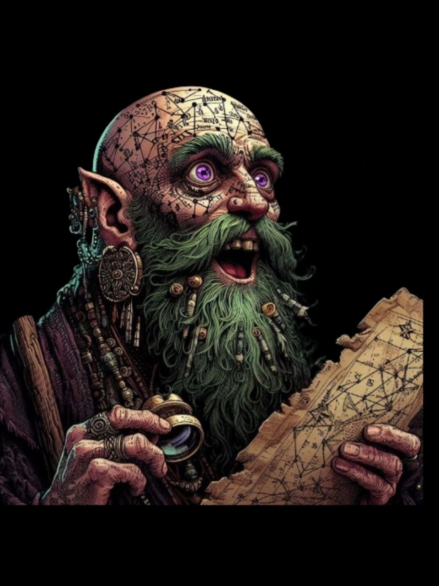

{: .portrait }

# Laszlo Morel

> *Hexblood — Circle of Stars Druid 10, Astrologo, divinatore e pubblicatore di oroscopi*

---

## Background

Laszlo — uno dei tanti nomi che si è dato — ha seguito gli avvenimenti del mondo **leggendo le stelle** e girando il Faerûn e i vari piani di esistenza.

Ha visto gli eventi del **Pozzo dei Draghi** (Rise of Tiamat), lo spostamento dei piani scaturito nell'**Averno** (Descent into Avernus) e la caduta del diavolo **Syracard** per mano dei fratelli. Si è annotato la scoperta di un marchingegno diabolico nella misteriosa regione del **Thay** che potrebbe cambiare le sorti del mondo. Ha conosciuto un gruppo di avventurieri nell'estremo nord che seguivano una **stella cadente** — tra cui un guerriero di metallo molto curioso (al tempo si faceva chiamare **Max**). Ha assistito all'arrivo dei demoni nell'**Underdark** (Out of the Abyss) e alla distruzione delle isole fluttuanti del **nuovo Netheril**.

Stella dopo stella, ha studiato e visto tutti questi eventi con un unico obiettivo: **fuggire dalla congrega di streghe** che lo hanno trasformato in un essere immondo.

Un uomo.

### La Verità

Laszlo in realtà è **Zulmira**, una **strega del Feywild**. La sua missione è tornare la strega che è sempre stata, cercando di raggiungere la **Dark Star**, la sua stella guida.

Nel suo girovagare, ha fatto conoscenza di un gruppo nomade, i **Vistani**, capaci di muoversi tra i piani di esistenza — compresi quelli del Terrore, come **Barovia**. Con la sua capacità di leggere le stelle e le fortune, riuscì a farsi dare un passaggio per Barovia.

---

## Equipaggiamento Particolare

- **Libricino nero** — Registra qualunque sogno abbia mai fatto.
- **Bastone con lente di Klaus** — Un genio della tecnologia ha dotato una lente incastonata sul suo bastone, che Laszlo usa per trarre divinazioni basandosi sul movimento degli astri celesti.
- **Star Map** — Carta stellare che funge da focus per gli incantesimi da druido.

---

## Attività

Pubblica gli **oroscopi** in piccoli pezzi di carta, studiando le stelle e aggiornando una mappa durante i suoi viaggi: *"Oroscopo e letture sul futuro di Laszlo Morel"*.

---

## Informazioni Base

| | |
|---|---|
| **Nome vero** | Zulmira |
| **Nome attuale** | Laszlo Morel (uno dei tanti) |
| **Razza** | Hexblood |
| **Classe** | Circle of Stars Druid 10 |
| **Background** | Haunted One |
| **Allineamento** | Neutral |
| **Forza** | 10 (+0) |
| **Destrezza** | 14 (+2) |
| **Costituzione** | 14 (+2) |
| **Intelligenza** | 19 (+4) |
| **Saggezza** | 20 (+5) |
| **Carisma** | 12 (+1) |

---

## Statistiche

- **PF Massimi:** 71
- **CA:** 16 (Studded Leather Armor + Wooden Shield)
- **Velocità:** 30ft
- **Iniziativa:** +2
- **Bonus di Competenza:** +4
- **Saggezza Passiva (Percezione):** 19

### Tiri Salvezza
| | |
|---|---|
| **Forza** | +0 |
| **Destrezza** | +2 |
| **Costituzione** | +2 |
| **Intelligenza** | +8 |
| **Saggezza** | +9 |
| **Carisma** | +1 |

### Abilità
Arcano +8, Intuizione +5, Indagare +4, Medicina +9, Natura +4, Percezione +9, Sopravvivenza +9, Addestrare Animali +5, Storia +4

### Linguaggi
Celestiale, Comune, Draconico, Druidico, Sylvan

### Competenze
Armature: leggere, medie, scudi (non metallici)
Armi: semplici
Strumenti: Herbalism Kit

---

## Privilegi e Tratti

### Tratti Razziali (Hexblood)
- **Darkvision** — 60ft.
- **Eerie Token** — Azione bonus: crea un token (capello, unghia, dente) per comunicare telepaticamente (25 parole) o vedere/sentire da esso entro 10 miglia. 1 uso per riposo lungo.
- **Hex Magic** — *Disguise Self* e *Hex* una volta al giorno ciascuno senza slot.

### Circle of Stars Druid 10
- **Druidic** — Lingua segreta dei druidi.
- **Ritual Casting** — Può lanciare come rituale qualsiasi incantesimo preparato con il taglio *ritual*.
- **Wild Shape** — 2 usi per riposo breve o lungo. Forme bestiali fino a CR 1 (senza volo o nuoto), per un massimo di 5 ore.
- **Wild Companion** — Può spendere un uso di Wild Shape per evocare *Find Familiar* (fey, temporaneo).
- **Star Map** — Mappa stellare come focus. Conosce *Guidance* e ha *Guiding Bolt* sempre preparato (3 lanci gratuiti/riposo lungo).
- **Starry Form** — Azione bonus: spende un uso di Wild Shape per assumere una forma stellare (10 minuti, luce 10ft/10ft). Sceglie una costellazione:
    - **Archer** — Azione bonus: attacco a distanza +9, 2d8+5 radianti.
    - **Chalice** — Quando cura con un incantesimo, un'altra creatura entro 30ft recupera 2d8+5 PF.
    - **Dragon** — Tratta come 10 qualsiasi tiro di 9 o inferiore su prove INT/SAG e TS Costituzione concentrazione. Volo 20ft (hover) al livello 10.
- **Cosmic Omen** — Ogni giorno, tira un d6 per determinare se ha **Weal** (aggiunge d6 a un tiro entro 30ft) o **Woe** (sottrae d6). 4 usi (bonus di competenza)/riposo lungo.
- **Twinkling Constellations** (livello 10) — Archer e Chalice fanno 2d8. Dragon dà volo 20ft (hover). Può cambiare costellazione all'inizio di ogni turno.

### Haunted One (Heart of Darkness)
Chi guarda nei suoi occhi capisce che ha affrontato orrori inimmaginabili. I popolani le mostrano ogni cortesia e fanno del loro meglio per aiutarla.

---

## Attacchi

| Attacco | Bonus | Danno | Tipo |
|---|---|---|---|
| **Guiding Bolt** | +9 | 4d6 | Radiant |
| **Primal Savagery** | +9 | 2d10 | Acido |
| **Produce Flame** | +9 | 2d8 | Fuoco |
| **Thorn Whip** | +9 | 2d6 | Perforante |
| **Archer (Starry Form)** | +9 | 2d8+5 | Radiant |
| **Quarterstaff** | +4 | 1d6 | Contundente |

**CD Tiro Salvezza:** 17 | **Bonus Attacco Incantesimo:** +9

---

## Incantesimi (Druid)

### Trucchetti (a volontà)
- **Guidance** — +1d4 a una prova di caratteristica.
- **Primal Savagery** — 2d10 acido in mischia.
- **Produce Flame** — 2d8 fuoco a distanza, 10 minuti di luce.
- **Thorn Whip** — 2d6 perforanti, tira il bersaglio 10ft.
- **Mending** — Ripara un oggetto rotto.

### Livello 1 (4 slot)
*Absorb Elements, Animal Friendship, Beast Bond, Charm Person, Create or Destroy Water, Cure Wounds, Detect Magic, Detect Poison and Disease, Earth Tremor, Entangle, Faerie Fire, Fog Cloud, Goodberry, Healing Word, Ice Knife, Jump, Longstrider, Protection from Evil and Good, Purify Food and Drink, Snare, Speak with Animals, Thunderwave, Guiding Bolt, Disguise Self, Hex, Illusory Script, Unseen Servant, Mage Armor*

### Livello 2 (3 slot)
*Air Bubble, Animal Messenger, Augury, Barkskin, Beast Sense, Continual Flame, Darkvision, Dust Devil, Earthbind, Enhance Ability, Enlarge/Reduce, Find Traps, Flame Blade, Flaming Sphere, Gust of Wind, Healing Spirit, Heat Metal, Hold Person, Lesser Restoration, Locate Animals or Plants, Locate Object, Moonbeam, Pass without Trace, Protection from Poison, Skywrite, Spike Growth, Summon Beast, Warding Wind, Wither and Bloom, Gentle Repose*

### Livello 3 (3 slot)
*Aura of Vitality, Call Lightning, Conjure Animals, Daylight, Dispel Magic, Elemental Weapon, Erupting Earth, Feign Death, Flame Arrows, Meld into Stone, Plant Growth, Protection from Energy, Revivify, Sleet Storm, Speak with Plants, Summon Fey, Tidal Wave, Wall of Water, Water Breathing, Water Walk, Wind Wall*

### Livello 4 (3 slot)
*Blight, Charm Monster, Confusion, Conjure Minor Elementals, Conjure Woodland Beings, Control Water, Divination, Dominate Beast, Elemental Bane, Fire Shield, Freedom of Movement, Giant Insect, Grasping Vine, Guardian of Nature, Hallucinatory Terrain, Ice Storm, Locate Creature, Polymorph, Stone Shape, Stoneskin, Summon Elemental, Wall of Fire, Watery Sphere, Find Greater Steed*

### Livello 5 (2 slot)
*Antilife Shell, Awaken, Commune with Nature, Cone of Cold, Conjure Elemental, Contagion, Control Winds, Geas, Greater Restoration, Insect Plague, Maelstrom, Mass Cure Wounds, Planar Binding, Reincarnate, Scrying, Transmute Rock, Tree Stride, Wall of Stone, Wrath of Nature, Commune, Hallow*

---

## Equipaggiamento

- Star Map (mappa stellare, focus druidico)
- Quarterstaff (con lente di Klaus)
- Studded Leather Armor
- Wooden Shield
- Explorer's Pack
- Libricino nero dei sogni
- Bastone di Gulthias
- Headband of Intellect
- Tomo di Strahd
- Collana di St. Markova
- Lettera distrutta
- 20 munizioni d'argento
- 6 paletti di legno
- Diamanti per *Revivify*
- Ampolle esplosive
- Pergamene di van Richten
- 3 dosi anti-acido
- 2 ricette per filtro d'amore
- 3 borse da erborista
- 2 ampolle di veleno di strega
- Fermaglio prezioso, orologio da taschino (pentacolo)
- 1054 GP + 9 SP

---

## Tratti Caratteriali

- Studiosa instancabile degli astri e degli eventi del mondo
- Porta il peso di un'identità rubata — una strega del Feywild intrappolata in un corpo che non è il suo
- Gentile con chi cerca la conoscenza, criptica con chi non sa ascoltare

### Ideali
Ritrovare sé stessa. Raggiungere la Dark Star. Tornare a essere Zulmira.

### Legami
I Vistani, che le hanno dato un passaggio tra i piani. Il suo libricino dei sogni. La lente di Klaus.

### Difetti
La sua ossessione per le stelle e la conoscenza la porta a fidarsi delle persone sbagliate. La sua vera identità è un segreto che custodisce gelosamente.