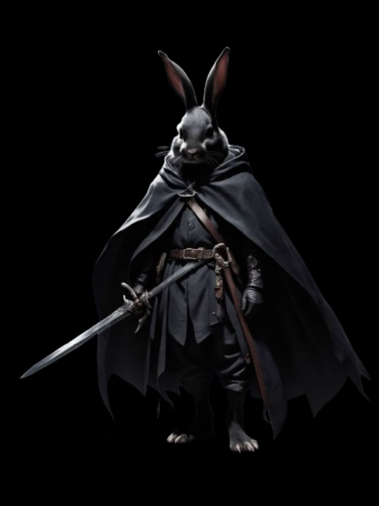

{: .portrait }

# Lûth Aen Elentir

> *Harengon — Rogue 1 / Gloom Stalker Ranger 4 / Battle Master Fighter 5, Cacciatore e artista del Circo del Witchlight*

---

## Background

Lûth Aen Elentir — nome che in elfico significa *"colui che ruba le stelle"* — fu lasciato ancora in fasce al **Circo del Witchlight**. Venne cresciuto da **Maeve**, un'Eladrin che si prende cura di tutti i trovatelli che giungono al circo.

Lûth crebbe in mezzo a molte creature diverse, che considera la sua **vera famiglia**. Questo lo ha reso una persona molto estroversa e competitiva, generosa ma gelosa delle proprie cose.

La sua famiglia non è mai stata molto ricca e lui non si è mai fatto troppi scrupoli a prendere in prestito quello che riusciva a sfilare dalle tasche dei distratti visitatori nella fiera. Questa abitudine è rimasta invariata crescendo, anche se adesso tende a rubare più per **divertimento** che per necessità. Di solito prende oggetti di poco valore che attirano la sua attenzione.

### La Caccia

Quando è diventato più grande, in lui è nata un'altra grande passione: la **caccia**. Così lui e alcuni dei suoi fratelli e sorelle hanno deciso di unirsi a una squadra di cacciatori. Questo ha permesso a Lûth di sviluppare notevoli abilità di mano e con i coltelli.

### L'Incontro con Baffo

Un giorno, un giocoliere del circo, un **tabaxi di nome Baffo**, notò Lûth mentre era impegnato in una delle sue esibizioni di caccia. Baffo rimase impressionato dalle sue abilità e gli propose di cominciare a lavorare con lui.

Da allora Lûth si allena tutti i giorni con coltelli e spade e aiuta Baffo a preparare le sue esibizioni, sognando un giorno di avere un **numero tutto suo** — anche se per ora il solo pensiero di trovarsi davanti a un gran numero di persone che assiste a una sua performance lo terrorizza.

---

## Aspetto Fisico

Lûth è un giovane coniglio dal **pelo nero e morbido**. Ha occhi grandi e scuri, che brillano di curiosità e vivacità. Il suo naso è piccolo e rosa, e le sue orecchie sono lunghe e appuntite.

Sul suo volto spicca una **cicatrice sulla fronte**, che gli ricorda un incidente avvenuto durante una caccia. Sul braccio sinistro ha un **tatuaggio** che rappresenta la parola elfica *"famiglia"* — fatto insieme ai suoi fratelli per ricordare il legame che li unisce. Al collo porta un **ciondolo** che contiene un frammento di pietra.

Indossa una tunica nera e una cintura di cuoio, che tiene al suo fianco una spada.

---

## Informazioni Base

| | |
|---|---|
| **Nome completo** | Lûth Aen Elentir |
| **Soprannome** | Lûth |
| **Razza** | Harengon |
| **Classe** | Rogue 1 / Gloom Stalker Ranger 4 / Battle Master Fighter 5 |
| **Background** | Urchin |
| **Allineamento** | Chaotic Good |
| **Forza** | 12 (+1) |
| **Destrezza** | 18 (+4) |
| **Costituzione** | 14 (+2) |
| **Intelligenza** | 13 (+1) |
| **Saggezza** | 16 (+3) |
| **Carisma** | 11 (+0) |

---

## Statistiche

- **PF Massimi:** 93
- **CA:** 14 (Leather Armor)
- **Velocità:** 30ft
- **Iniziativa:** +4 (+3 Dread Ambusher +4 prof Hare-Trigger)
- **Bonus di Competenza:** +4
- **Saggezza Passiva (Percezione):** 21

### Tiri Salvezza
| | |
|---|---|
| **Forza** | +1 |
| **Destrezza** | +8 |
| **Costituzione** | +2 |
| **Intelligenza** | +5 |
| **Saggezza** | +3 |
| **Carisma** | +0 |

### Abilità
Acrobazia +8, Furtività +12, Percezione +11, Rapidità di Mano +8, Intuizione +7, Sopravvivenza +7, Indagare +5, Inganno +4

### Linguaggi
Comune, Elfico, Halfling, Sylvan, Thieves' Cant

### Competenze
Armature: leggere, medie, scudi
Armi: marziali, semplici, Hand Crossbow
Strumenti: Disguise Kit, Leatherworker's Tools, Poisoner's Kit, Thieves' Tools

---

## Privilegi e Tratti

### Tratti Razziali (Harengon)
- **Hare-Trigger** — Aggiunge il bonus di competenza all'iniziativa.
- **Leporine Senses** — Competenza in Percezione.
- **Lucky Footwork** — Reazione: fallendo un TS Destrezza, tira 1d4 e lo aggiunge al risultato.
- **Rabbit Hop** — Azione bonus: salta un numero di piedi pari a 5 × bonus di competenza (20ft), senza provocare attacchi di opportunità. 4 usi per riposo lungo.

### Rogue 1
- **Sneak Attack** — +1d6 danni extra una volta per turno con vantaggio o se un alleato è entro 5ft.
- **Thieves' Cant** — Gergo segreto dei ladri.

### Gloom Stalker Ranger 4
- **Deft Explorer (Canny)** — Competenza raddoppiata su **Furtività**.
- **Favored Foe** — Azione bonus: marchia un bersaglio, +1d6 danni al primo colpo per turno. 4 usi/riposo lungo.
- **Fighting Style: Two-Weapon Fighting** — Aggiunge il modificatore di Destrezza al danno del secondo attacco.
- **Spellcasting** — CD 15, bonus attacco +7.
- **Primal Awareness** — *Speak with Animals* 1/riposo lungo senza slot.
- **Dread Ambusher** — Aggiunge Saggezza all'iniziativa. +10ft velocità al primo turno. Attacco extra al primo turno con +1d8 danni.
- **Umbral Sight** — Darkvision 60ft. Invisibile al buio per creature con darkvision.

### Battle Master Fighter 5
- **Second Wind** — Azione bonus: recupera 1d10+5 PF. 1/riposo breve o lungo.
- **Fighting Style** — *(da definire)*
- **Action Surge** — Azione aggiuntiva in un turno. 1/riposo breve o lungo.
- **Extra Attack** — Due attacchi per azione Attacco.
- **Combat Superiority** — 4 dadi di superiorità (d8). Manovre:
    - **Trip Attack** — +d8 danni, atterra (TS Forza).
    - **Ambush** — +d8 a Furtività o Iniziativa.
    - **Precision Attack** — +d8 al tiro per colpire.
    - **Riposte** — Reazione: attacco in mischia se un nemico manca.
    - **Parry** — Reazione: riduce il danno subito di d8 + Destrezza.
    - **Pushing Attack** — +d8 danni, spinge 15ft (TS Forza).

### Talento
- **Sentinel** — Colpendo con un attacco di opportunità, velocità 0. Attacco di opportunità anche se il nemico fa Disengage. Reazione per attaccare chi attacca un alleato entro 5ft.

---

## Attacchi

| Arma | Bonus | Danno | Tipo |
|---|---|---|---|
| **Rapier** | +7 | 1d8+3 | Perforante |
| **Shortsword (argento)** | +8 | 1d6+4 | Perforante |
| **Longbow** | +8 | 1d8+4 | Perforante |
| **Longsword +1** | +6 | 1d8+1 / 1d10+1 | Tagliente |
| **Claw** | +9 | 2d4+4 | Tagliente |
| **Bite** | +9 | 1d8+4 | Perforante |

---

## Incantesimi (Ranger)

**CD Tiro Salvezza:** 15 | **Bonus Attacco:** +7

### Livello 1 (3 slot)
- **Zephyr Strike** — Movimento senza attacchi di opportunità, vantaggio su un attacco, +1d8 forza, +30ft velocità.
- **Absorb Elements** — Reazione: resistenza a acido/freddo/fuoco/fulmine/tuono, +1d6 del tipo al prossimo attacco.
- **Hunter's Mark** — +1d6 danni, vantaggio su Percezione/Sopravvivenza per trovare il bersaglio. Concentrazione fino a 1h.
- **Speak with Animals** — Comprende e comunica con le bestie per 10 minuti.
- **Disguise Self** — Si traveste magicamente per 1 ora.

---

## Equipaggiamento

- Rapier
- Shortsword (argento)
- Longbow
- Longsword +1
- Leather Armor
- Thieves' Tools
- Disguise Kit
- Hooded Lantern + Oil
- Cannocchiale (72mt)
- Silk Rope
- Mappa di Barovia
- Paletto di legno
- Specchio d'argento
- 267 GP + 5 SP + valore in pietre preziose (532 GP)
- *Bambola Blinsky*
- *Dente di tigre (Rictavio)*
- *Bambola del castello di Strahd*
- 8 medaglioni di Heroes' Feast
- 10 frammenti di scaglie di drago

---

## Tratti Caratteriali

Estroverso, generoso, competitivo, geloso delle sue cose.

### Ideali
Vuole avere uno spettacolo tutto suo al Circo del Witchlight.

### Legami
Maeve e i suoi 11 fratelli e sorelle del Circo del Witchlight.

### Difetti
Impulsivo, gli piace scommettere. Prende in prestito ciò che non è suo. Terrorizzato all'idea di esibirsi davvero davanti a un pubblico.