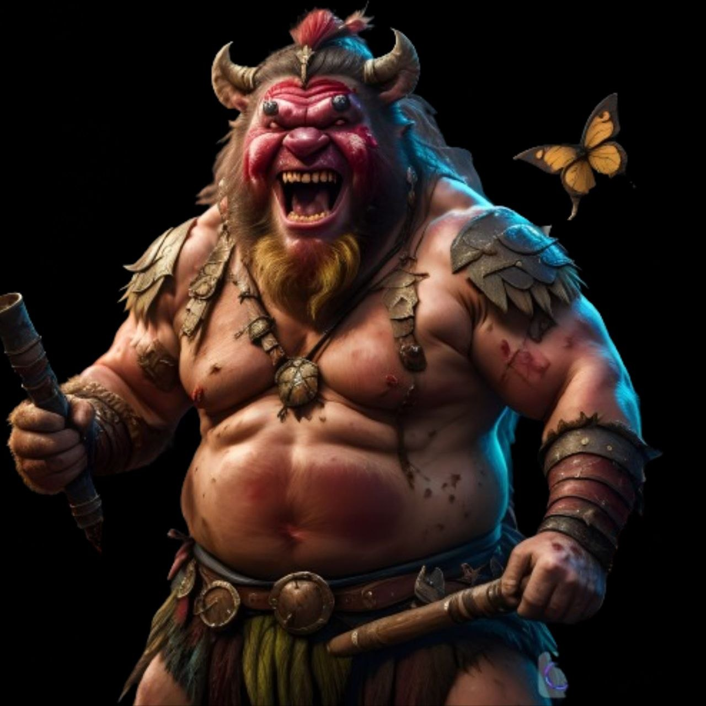

{: .portrait }

# Nezuko

> *Bugbear — Path of the Beast Barbarian 10, Uomo forzuto del circo errante*

---

## Background

Nezuko è un **bugbear** cresciuto in una tribù di barbari. A differenza del resto del suo clan, ha sempre avuto uno **spirito dolce e cordiale** — non ha mai amato la violenza e i saccheggi a cui era sempre obbligato a prendere parte.

La sua tribù aveva sviluppato negli anni una particolare tecnica per mischiare varie radici, foglie e funghi trovati in natura che, una volta sniffati, potenziavano l'effetto della collera e dell'ira che li pervadeva durante la battaglia.

### La Caduta

Un giorno, in seguito alla tentata razzia di un'importante città, il suo clan venne inseguito e dimezzato dalla guardia cittadina. Lui stesso cadde sotto i colpi dei nemici e fu **abbandonato, creduto morto**.

Svenne sul campo di battaglia e al suo risveglio, malconcio e tramortito, decise che avrebbe colto l'occasione per **scappare da quella vita di violenze** e dedicarsi a qualcosa che portasse gioia alla gente.

### Una Nuova Vita

Si unì a un **circo errante** e, approfittando della sua stazza fisica, iniziò ad esibirsi come **uomo forzuto**.

Purtroppo aveva sviluppato una **dipendenza** da quel miscuglio di sostanze che per molti anni aveva inalato. Non poteva permettersi di cadere in tentazione perché sapeva che avrebbe corso il rischio di perdere il controllo di sé stesso e far male a quelle persone che ormai erano diventate la sua nuova famiglia.

Per ovviare a questo problema, da circa un anno si faceva visitare periodicamente dallo **psicologo del circo** — e la cosa sembrava aiutarlo molto.

---

## Informazioni Base

| | |
|---|---|
| **Nome completo** | Nezuko |
| **Razza** | Bugbear |
| **Classe** | Path of the Beast Barbarian 10 |
| **Background** | Gladiator |
| **Allineamento** | Neutral |
| **Forza** | 18 (+4) |
| **Destrezza** | 14 (+2) |
| **Costituzione** | 16 (+3) |
| **Intelligenza** | 9 (-1) |
| **Saggezza** | 14 (+2) |
| **Carisma** | 11 (+0) |

---

## Statistiche

- **PF Massimi:** 133
- **CA:** 17 (Unarmored Defense: 10 + 2 Des + 3 Cos)
- **Velocità:** 40ft
- **Iniziativa:** +2 (vantaggio con Feral Instinct)
- **Bonus di Competenza:** +4
- **Saggezza Passiva (Percezione):** 16

### Tiri Salvezza
| | |
|---|---|
| **Forza** | +8 |
| **Destrezza** | +2 |
| **Costituzione** | +7 |
| **Intelligenza** | -1 |
| **Saggezza** | +2 |
| **Carisma** | +0 |

### Abilità
Acrobazia +6, Atletica +8, Furtività +6, Intimidire +4, Intrattenere +4, Percezione +6, Sopravvivenza +6, Natura +3

### Linguaggi
Comune, Goblin

### Competenze
Armature: leggere, medie, scudi
Armi: marziali, semplici
Strumenti: Disguise Kit, Horn

---

## Privilegi e Tratti

### Tratti Razziali (Bugbear)
- **Darkvision** — 60ft.
- **Fey Ancestry** — Vantaggio sui TS per evitare o terminare la condizione *charmato*.
- **Long-Limbed** — La portata in mischia è aumentata di 5ft.
- **Powerful Build** — Conta come una taglia più grande per capacità di carico.
- **Sneaky** — Competenza in Furtività. Può muoversi e fermarsi in spazi per una creatura Piccola.
- **Surprise Attack** — Se una creatura non ha ancora avuto un turno in combattimento, colpendola infligge 2d6 danni extra.

### Path of the Beast Barbarian 10
- **Rage** — 4 usi per riposo lungo. Mentre è in ira:
    - Vantaggio su prove e TS di Forza
    - +3 danni in mischia con Forza
    - Resistenza a contundenti, perforanti, taglienti
    - Dura 1 minuto
- **Unarmored Defense** — CA = 10 + Des + Cos.
- **Reckless Attack** — Vantaggio sugli attacchi in mischia, ma vantaggio contro di lui.
- **Danger Sense** — Vantaggio sui TS Destrezza contro effetti visibili.
- **Primal Knowledge** — Competenze aggiuntive acquisite ai livelli 3 e 10.
- **Form of the Beast** — Quando entra in ira, sceglie un'arma naturale:
    - **Bite** — 1d8 perforanti. Una volta per turno, se ha meno di metà PF, recupera PF pari al bonus di competenza.
    - **Claws** — 1d6 taglienti. Con l'azione Attacco, può fare un attacco in più con gli artigli.
    - **Tail** — 1d8 perforanti, portata 10ft. Reazione: +1d8 alla CA.
- **Extra Attack** — Due attacchi per azione Attacco.
- **Bestial Soul** — Le armi naturali contano come magiche. Sceglie un adattamento dopo ogni riposo (nuoto, arrampicata, salto potenziato).
- **Feral Instinct** — Vantaggio sull'iniziativa. Se sorpreso ma non incapacitato, può agire normalmente entrando in ira.
- **Instinctive Pounce** — Quando entra in ira con azione bonus, può muoversi fino a metà velocità.
- **Brutal Critical** — Un dado danno extra sui critici in mischia.
- **Infectious Fury** — Quando colpisce con armi naturali in ira, il bersaglio deve superare un TS Saggezza (CD 15) o attaccare un'altra creatura o subire 2d12 psichici. 2 usi/riposo lungo.

### Gladiator (By Popular Demand)
Può sempre trovare un posto dove esibirsi, ricevendo vitto e alloggio gratuiti. È riconoscibile come figura locale nei luoghi dove si è esibito.

---

## Attacchi

| Arma | Bonus | Danno | Tipo |
|---|---|---|---|
| **Spadone magico** | +9 | 2d6+5 | Tagliente |
| **Warhammer (1M)** | +8 | 1d8+4 | Contundente |
| **Warhammer (2M)** | +8 | 1d10+4 | Contundente |
| **Spada lunga argentata** | +8 | 1d8+4 | Tagliente |
| **Javelin** | +8 | 1d6+4 | Perforante |
| **Bite (Form of the Beast)** | +8 | 1d8+4 | Perforante |
| **Claws (Form of the Beast)** | +8 | 1d6+4 | Tagliente |
| **Tail (Form of the Beast)** | +8 | 1d8+4 | Perforante |
| **Bite (Vampiro)** | +8 | 3d6+4 | Perforante |

---

## Equipaggiamento

- Spadone magico
- Warhammer
- 4 Javelin
- Spada lunga argentata
- Explorer's Pack
- Costume da gladiatore
- Fermacapelli con pietre preziose
- 2 denti di tigre sciabola
- 3 agate muschiate
- Pietre/gemme/diamanti dalla tana del drago
- *Fiala della Guarigione* (1d6× carica, effetti heal se bevuta tutta)
- 1 pozione 2d4+2
- *Beneficio del Faro* (1× fortunato)
- 1 GP

---

## Tratti Caratteriali

*"Adoro un buon insulto, persino se diretto a me. Conosco una storia pertinente a quasi ogni situazione."*

### Ideali
**Onestà** — L'arte dovrebbe riflettere l'anima; dovrebbe venire da dentro e rivelare chi siamo veramente. (Qualsiasi)

### Legami
Farà di tutto per dimostrarsi superiore al suo rivale giurato.

### Difetti
Nonostante i suoi migliori sforzi, è inaffidabile con i suoi amici. La dipendenza dalle sostanze della sua tribù è un demone con cui lotta ogni giorno.