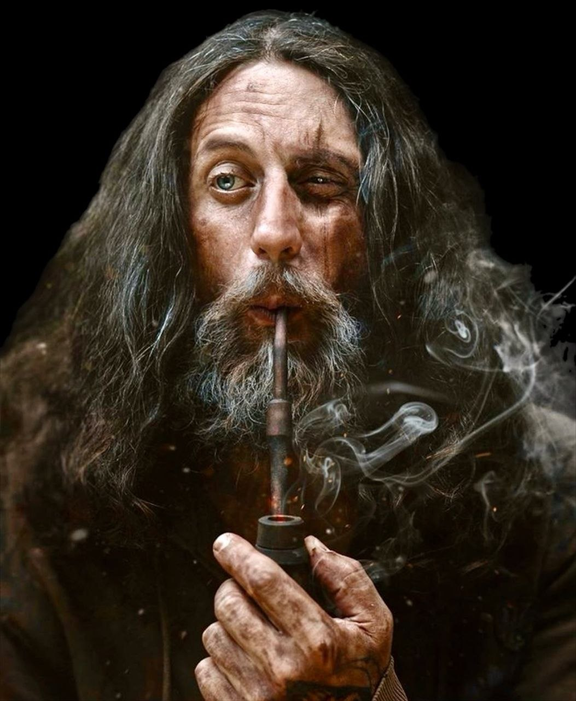

{: .portrait }

# Radagast il Magnifico

> *Variant Human — Divine Soul Sorcerer 6, Pellegrino, guaritore e artista circense*

---

## Background

Della vita di **Grigorij Surkov** si sa molto poco.

Viene da un lontano e freddo paese del nord. Da bambino iniziò ad avere a che fare con le **arti stregonesche** che, con il passare del tempo, riuscì sempre di più a gestire e controllare.

Da ragazzo affermò di aver avuto una **visione del Dio**, e decise dunque di abbracciare completamente la vita da chierico, fondendola con le sue arti stregonesche. Divenne un **Divine Soul Sorcerer** — un'anima benedetta dalla divinità stessa. Intraprese un lungo pellegrinaggio nei luoghi sacri di quel Dio, diventando un vero **Pellegrino** e iniziando a guadagnarsi il soprannome di **"Folle di Dio"**.

### Il Folle di Dio

Grigorij vestiva come un chierico, ma non osservava per niente le regole della sua religione. Amava il **buon cibo**, il **vino** e soprattutto le **donne**.

Fu per questo motivo che dovette scappare dalla sua terra quando un gruppo di **mariti gelosi** si unirono per ucciderlo.

### Al Circo

Si unì così al circo, sperando di poter cambiare vita e nome. Iniziò a farsi chiamare **Radagast il Magnifico** e mise su uno spettacolo di arti magiche. Nel tempo libero, curava eventuali fratture o malattie dei membri del circo.

---

## Informazioni Base

| | |
|---|---|
| **Nome vero** | Grigorij Surkov |
| **Nome d'arte** | Radagast il Magnifico |
| **Soprannome** | Folle di Dio |
| **Razza** | Variant Human |
| **Classe** | Divine Soul Sorcerer 6 |
| **Background** | Acolyte |
| **Allineamento** | Neutral Good |
| **Forza** | 13 (+1) |
| **Destrezza** | 16 (+3) |
| **Costituzione** | 16 (+3) |
| **Intelligenza** | 15 (+2) |
| **Saggezza** | 14 (+2) |
| **Carisma** | 20 (+5) |

---

## Statistiche

- **PF Massimi:** 40
- **CA:** 13 (16 con *Mage Armor*)
- **Velocità:** 30ft
- **Iniziativa:** +3
- **Bonus di Competenza:** +3
- **Saggezza Passiva (Percezione):** 12

### Tiri Salvezza
| | |
|---|---|
| **Forza** | +1 |
| **Destrezza** | +3 |
| **Costituzione** | +6 |
| **Intelligenza** | +2 |
| **Saggezza** | +2 |
| **Carisma** | +8 |

### Abilità
Inganno +8, Persuasione +8, Intrattenere +5, Intimidire +5, Intuizione +5, Medicina +5, Religione +5, Arcano +2

### Linguaggi
Celestiale, Comune, Draconico, Inferno

### Competenze
Armi: Dagger, Dart, Light Crossbow, Quarterstaff, Sling

---

## Privilegi e Tratti

### Tratti Razziali (Variant Human)
- **Talento: War Caster** — Vantaggio sui TS Costituzione per concentrazione. Può eseguire componenti somatiche con armi o scudo in mano. Può lanciare un incantesimo (tempo di lancio 1 azione, singolo bersaglio) come attacco di opportunità.

### Acolyte (Shelter of the Faithful)
Riceve cure gratuite nei templi della sua fede e può vivere a uno stile di vita modesto grazie a essi. Può chiamare i sacerdoti del suo tempio per assistenza non pericolosa.

### Divine Soul Sorcerer 6
- **War Caster** — Vantaggio sui TS Costituzione per concentrazione.
- **Sorcery Points** — 6 punti stregoneria per riposo lungo. Usi:
    - **Flexible Casting** — Crea slot incantesimo o converte slot in punti.
    - **Twinned Spell** — 1 punto per cantrip, o livello slot per incantesimo: bersaglia una seconda creatura.
    - **Quickened Spell** — 2 punti: cambia un incantesimo da 1 azione a 1 azione bonus.
    - **Magical Guidance** — 1 punto: rilancia una prova di caratteristica fallita.
- **Empowered Healing** (livello 6) — 1 punto stregoneria: rilancia qualsiasi dado di cura di un incantesimo, una volta per turno. Funziona su sé o su un alleato entro 1.5m.

---

## Attacchi

| Attacco | Bonus | Danno | Tipo |
|---|---|---|---|
| **Fire Bolt** | +8 | 2d10 | Fuoco |
| **Chill Touch** | +8 | 2d8 | Necrotic |
| **Ray of Frost** | +8 | 2d8 | Cold |
| **Quarterstaff (1M)** | +4 | 1d6+1 | Contundente |
| **Quarterstaff (2M)** | +4 | 1d8+1 | Contundente |
| **Dagger** | +6 | 1d4+3 | Perforante |
| **Fireball** | DC 16 | 8d6 | Fuoco |

**CD Tiro Salvezza:** 16 | **Bonus Attacco Incantesimo:** +8

---

## Incantesimi (Sorcerer)

### Trucchetti (a volontà)
- **Fire Bolt** — 2d10 fuoco a distanza.
- **Dancing Lights** — 4 luci danzanti, 1 minuto.
- **Chill Touch** — 2d8 necrotici, impedisce guarigione, svantaggio se non morto.
- **Message** — Messaggio sussurrato a 120ft.
- **Ray of Frost** — 2d8 freddo, -10ft velocità.

### Livello 1 (4 slot)
- **Cure Wounds** — 1d8+5 PF al tocco.
- **Healing Word** — Azione bonus: 1d4+5 PF a 60ft.

### Livello 2 (3 slot)
- **Enlarge/Reduce** — Ingrandisce o rimpicciolisce una creatura/oggetto (concentrazione).
- **Invisibility** — Invisibilità per 1 ora (concentrazione).
- **Misty Step** — Azione bonus: teletrasporto 30ft.

### Livello 3 (3 slot)
- **Fireball** — 8d6 fuoco in sfera 20ft (TS Destrezza metà).

---

## Equipaggiamento

- Quarterstaff
- 2 Dagger
- Arcane Focus
- Holy Symbol (del Dio)
- Prayer Wheel
- Vestments sacerdotali
- 5 bastoncini d'incenso
- Explorer's Pack (zaino, sacco a pelo, kit da pasto, esca, 10 torce, 10 razioni, otre)
- Spartito musicale
- 14 GP

---

## Tratti Caratteriali

- Vive la fede come un'esperienza personale, non come un insieme di regole
- Ama i piaceri della vita: cibo, vino, donne
- Sincero nella sua devozione, ma indisciplinato nelle sue manifestazioni

### Ideali
La luce divina si manifesta in modi imprevedibili. Anche un peccatore può essere uno strumento del Dio.

### Legami
Il circo è il suo rifugio e la sua nuova famiglia. Il suo passato nel nord lo costringe a guardarsi sempre le spalle.

### Difetti
Le donne. Il vino. L'incapacità di resistere a una tentazione. E un gruppo di mariti gelosi che ancora lo cerca.