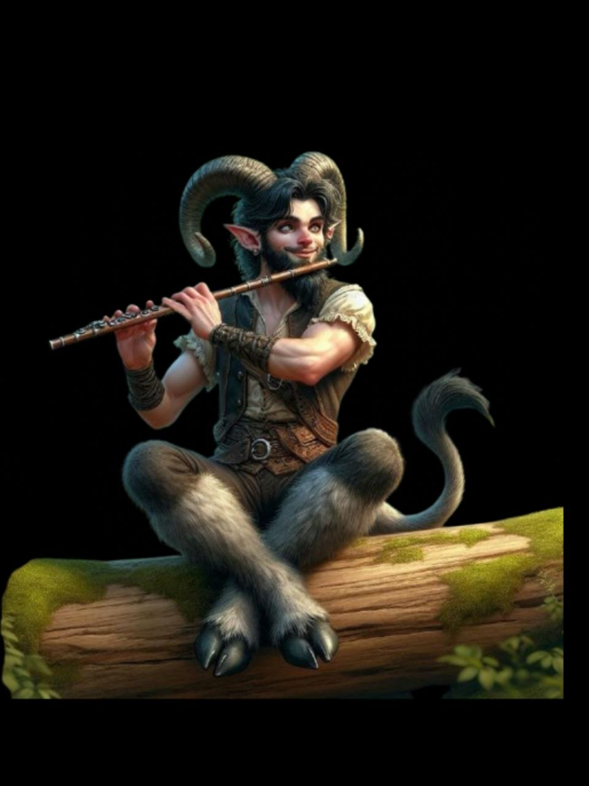

{: .portrait }

# Slap

> *Satyr — College of Spirits Bard 10, Bardo itinerante con problemi di alcol e di cuore*

---

## Background

Slap — questo era il suo nome, e questo è tutto ciò che ha sempre voluto essere — è un **satiro bardo** originario del **Regno delle Fate**. Vaga spesso su altri piani di esistenza per portare la sua arte su di essi, ma soprattutto per **provarci con le umane** — che però lo respingono sempre.

Purtroppo aveva questa **ossessione**.

Ogni rifiuto lo getta in una spirale di depressione e alcol nelle peggiori taverne, lasciando spesso debiti e a volte scatenando risse. Il bere lo ha messo in situazioni sempre più assurde.

### Le Disavventure

Una volta gli mise una **voglia matta di cantare** e, abbandonandosi alla vocazione, cantava a un volume eccessivo. La sua vena lirica però urtò la sensibilità musicale di due cittadini che accompagnarono la sua romanza a **suon di pugni** e lo ridussero in fin di vita.

Un altro giorno fu preso da un'improvvisa pulsione per le **arrampicate**. Non trovando a disposizione pareti di montagna, e ritrovandosi invece davanti gli allettanti rilievi marmorei della chiesa di **Milil**, pensò bene di sfogare quel suo incontenibile desiderio cercando di scalare a mani nude. Le guardie lo fecero desistere dalla sua impresa facendolo scappare.

### Al Circo

Pieno di debiti in varie locande e umane adirate per averci provato, si sentiva inseguito. Forse era meglio rimanere nascosto per un po' di tempo — e quale miglior posto di un **circo** dove poteva anche esibirsi, guadagnando qualche moneta d'oro con la quale poteva ripagare i debiti… o usarli tutti per bere.

---

## Informazioni Base

| | |
|---|---|
| **Nome** | Slap |
| **Razza** | Satyr |
| **Classe** | College of Spirits Bard 10 |
| **Background** | Entertainer (Fire-eater) |
| **Allineamento** | Chaotic Good |
| **Forza** | 9 (-1) |
| **Destrezza** | 14 (+2) |
| **Costituzione** | 11 (+0) |
| **Intelligenza** | 7 (-2) |
| **Saggezza** | 11 (+0) |
| **Carisma** | 18 (+4) |

---

## Statistiche

- **PF Massimi:** 49
- **CA:** 12 (Leather Armor)
- **Velocità:** 35ft
- **Iniziativa:** +2
- **Bonus di Competenza:** +4
- **Saggezza Passiva (Percezione):** 12

### Tiri Salvezza
| | |
|---|---|
| **Forza** | -1 |
| **Destrezza** | +6 |
| **Costituzione** | +0 |
| **Intelligenza** | -2 |
| **Saggezza** | +0 |
| **Carisma** | +8 |

### Abilità
Acrobazia +10, Furtività +10, Intrattenere +12, Persuasione +8, Inganno +8, Rapidità di Mano +10, Intimidire +6

### Linguaggi
Comune, Sylvan

### Competenze
Armature: leggere
Armi: semplici, stocco, spada corta, arco corto, balestra a mano
Strumenti: Disguise Kit, Drum, Flute, Harp, Lute, Pan Flute

---

## Privilegi e Tratti

### Tratti Razziali (Satyr)
- **Ram** — Colpo con le corna: 1d6 + Forza contundenti.
- **Magic Resistance** — Vantaggio sui TS contro incantesimi.
- **Mirthful Leaps** — Quando salta, aggiunge 1d8 alla distanza coperta.

### Reveler (Entertainer)
- Competenza in Intrattenere e Persuasione, più uno strumento musicale.
- **By Popular Demand** — Trova sempre un posto dove esibirsi, con vitto e alloggio gratuiti.

### Bard 10
- **Bardic Inspiration** (d10) — 4 usi/riposo breve o lungo. Azione bonus: alleato entro 60ft riceve un dado d10 da aggiungere a un tiro.
- **Ritual Casting** — Può lanciare come rituale qualsiasi incantesimo da bardo con il taglio *ritual*.
- **Jack of All Trades** — Aggiunge metà bonus di competenza alle prove non competenti.
- **Song of Rest** — Durante un riposo breve, alleati che spendono Dadi Vita recuperano 1d6 PF extra.
- **Magical Inspiration** — Un alleato con un dado di Ispirazione Bardica può aggiungerlo a danni o cure di un incantesimo.
- **Font of Inspiration** — Recupera tutti gli usi di Ispirazione Bardica dopo un riposo breve o lungo.
- **Countercharm** — Azione: performance che dà vantaggio su TS contro spaventato e affascinato (30ft).
- **Magical Secrets** — Incantesimi da altre classi (2 scelti al livello 10).

### College of Spirits 10
- **Focus spirituale** — Può usare candela, sfera di cristallo, teschio, tavola spiritica o mazzo di tarocchi come focus. Al 6° livello, quando lancia un incantesimo che infligge danni o cura, tira 1d6 e lo aggiunge.
- **Racconti dall'aldilà** (Tales from Beyond) — Azione bonus: spende un uso di Ispirazione Bardica e tira sulla tabella Racconti degli Spiriti (1d12). Mantiene il racconto finché non lo usa (azione, bersaglio entro 9m) o finisce un riposo:
    1. **Animale intelligente** — +dado di ispirazione a prove INT/SAG/CAR per 10 minuti.
    2. **Famoso duellante** — Attacco in mischia +4, danni = 2× dado ispirazione + Carisma.
    3. **Amici amati** — PF temporanei = dado ispirazione + Carisma a due creature.
    4. **Fuga** — Reazione: teletrasporto 9m (e fino a +4 creature).
    5. **Vendicatore** — 1 minuto: chi colpisce il bersaglio subisce danni forza = dado ispirazione.
    6. **Viaggiatore** — PF temporanei = dado ispirazione + livello. Velocità +3m, CA +1.
    7. **Ingannatore** — TS Saggezza o danni psichici (2× dado ispirazione) + incapacitato 1 turno.
    8. **Fantasma** — Invisibile 1 turno. Se colpisce, +dado ispirazione danni necrotici + spaventato.
    9. **Bruto** — TS Forza o danni tuono (3× dado ispirazione) + prono.
    10. **Drago** — Cono 9m, TS Destrezza o danni fuoco (4× dado ispirazione).
    11. **Angelo** — Cura 2× dado ispirazione + Carisma, termina una condizione (accecato, assordato, paralizzato, pietrificato, avvelenato).
    12. **Piega-mente** — TS Intelligenza o danni psichici (3× dado ispirazione) + stordito 1 turno.
- **Sussurri guida** (Guiding Whispers) — Impara *Guidance*, che ha portata 18m per lui.

### Talenti
- **Fey Touched** — +1 Carisma (da 17 a 18). Impara *Misty Step* e *Silvery Barbs* (1 gratuiti/riposo lungo).
- **Tough** — +20 PF massimi (2 per livello).

---

## Attacchi

| Attacco | Bonus | Danno | Tipo |
|---|---|---|---|
| **Stocco** | +6 | 1d8+2 | Perforante |
| **Arco corto** | +6 | 1d6+2 | Perforante |
| **Ariete (corna)** | +3 | 1d6-1 | Contundente |
| **Beffa crudele** | DC 16 | 3d4 | Psichico |
| **Sussurri dissonanti** | DC 16 | 4d6 | Psichico |
| **Spruzzo di carte** | DC 16 | 3d10 | Forza |
| **Shatter** | DC 16 | 4d8 | Tuono |
| **Stasi sinaptica** | DC 16 | 8d6 | Psichico |
| **Lancia psichica di Raulothim** | +8 | 7d6 | Psichico |

**CD Tiro Salvezza:** 16 | **Bonus Attacco Incantesimo:** +8

---

## Incantesimi (Bard)

### Trucchetti (a volontà)
- **Illusione Minore** — Suono o immagine illusoria.
- **Beffa crudele** — 3d4 psichici, svantaggio al prossimo attacco (TS Saggezza).
- **Guida** — +1d4 a una prova (portata 18m per lui).
- **Rombo di tuono** — 2d6 tuono in cono 1.5m (TS Costituzione).
- **Campana per i morti** — 3d8 (o 3d12 se ferito) necrotici (TS Saggezza).

### Livello 1 (4 slot)
- **Sussurri dissonanti** — 4d6 psichici + bersaglio fugge via (TS Saggezza).
- **Parola guaritrice** — Azione bonus: 1d4+4 PF a distanza.
- **Punte argentate (Silvery Barbs)** — Reazione: forza un reroll, poi vantaggio a un alleato.
- **Sonno** — 5d8 PF di creature addormentate.
- **Identificare** (R) — Identifica proprietà magiche di un oggetto.

### Livello 2 (3 slot)
- **Spruzzo di carte** — Cono 4.5m, 3d10 forza + accecato (TS Destrezza).
- **Immagine speculare** — 3 duplicati illusori, 1 minuto.
- **Invisibilità** — Invisibile per 1 ora (concentrazione).
- **Shatter** — 4d8 tuono in sfera 3m (TS Costituzione).
- **Passo velato (Misty Step)** — Azione bonus: teletrasporto 9m.
- **Appassire e fiorire** — 3d6 necrotici + un alleato spende un Dado Vita per curarsi.

### Livello 3 (3 slot)
- **Parola guaritrice di massa** — Azione bonus: 1d4+4 PF a 6 creature.
- **Trama ipnotica** — Cubo 9m, affascina + incapacita (TS Saggezza, concentrazione).
- **Counterspell** — Reazione: interrompe un incantesimo.
- **Spirit Shroud** — +1d8 danni (radiante/necrotico/freddo) entro 3m (concentrazione).

### Livello 4 (3 slot)
- **Invisibilità maggiore** — Invisibile per 1 minuto (concentrazione).
- **Lancia psichica di Raulothim** — 7d6 psichici + incapacitato (TS Intelligenza).
- **Occhio arcano** — Occhio invisibile, 1 ora, 9m/round (concentrazione).

### Livello 5 (2 slot)
- **Stasi sinaptica** — 8d6 psichici in sfera 6m + -1d6 a tiri per 1 minuto (TS Intelligenza).
- **Circle of Power** — Vantaggio TS magia per alleati in 9m (concentrazione). Se superano un TS per metà danno, zero danno.

---

## Equipaggiamento

- Stocco
- Arco corto + 20 frecce
- Leather Armor
- Teschio di lupo (focus spirituale)
- Lira d'oro
- Tunica degli Oggetti Utili
- Explorer's Pack
- Corda 15m
- 144 GP
- *Cono di freddo*

---

## Tratti Caratteriali

- Artista nel sangue, ma incapace di gestire il successo o il rifiuto
- Ossessionato dalle umane, che invariabilmente lo respingono
- Quando beve, perde ogni senso della misura e del pericolo

### Ideali
L'arte sopra ogni cosa. E l'amore. Peccato che l'amore non voglia lui.

### Legami
Il circo è il suo rifugio. La musica è la sua unica fedele compagna.

### Difetti
L'alcol. Le donne. La mancanza totale di autocontrollo. In qualsiasi ordine, gli creano sempre guai.

### Fobia
Posti chiusi (claustrofobia).