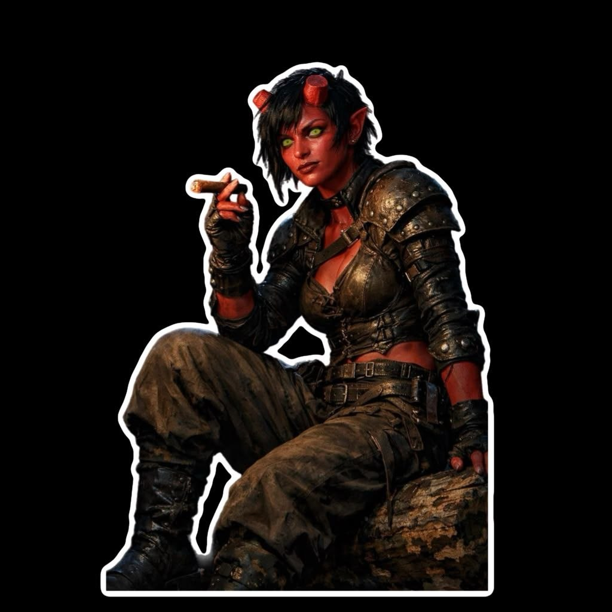

{: .portrait }

# Asha

> *Tiefling (Asmodeus) — Fighter (Arcane Archer) 7 / Ranger (Monster Slayer) 3, Guardia di Neverwinter*

---

## Background

Asha era nata per adempiere a un **oscuro presagio**, invocata da cultisti in cerca di potere. Fin da subito mostrava tratti evidenti del suo retaggio infernale: pelle scarlatta, occhi gialli e corna prominenti.

Cresciuta nelle profondità di una **biblioteca segreta**, sotto la guida di un vecchio maestro umano, un mago incaricato di proteggerla dal mondo e dal suo stesso destino, Asha imparò a conoscere le arti arcane e i pericoli delle profezie.

### La Caduta

Quando un culto rivale trovò il suo nascondiglio, Asha combatté per difendere il suo unico amico. Durante lo scontro, il **mago morì**, e il capo dei fanatici, riuscendo ad arrestarla, tentò un rituale di purificazione: **recise le corna di Asha** con una lama consacrata, credendo così di spezzare il legame tra lei e la profezia. Le corna — segno del suo retaggio e possibile chiave, secondo loro, per l'apocalisse — furono rubate come trofeo.

Sconvolta e mutilata nell'onore quanto nel corpo, Asha lasciò la sua casa in cerca di risposte. Girovagò per molto tempo tra le foreste del regno.

### Una Nuova Casa

Finché trovò lavoro nelle **guardie cittadine di Neverwinter**, che la accolsero riconoscendo in lei bravura nel combattimento. Divenne famosa tra le guardie soprattutto per la sua **mira impressionante con l'arco**, ma anche per il suo sarcasmo, la testardaggine e l'incrollabile senso di giustizia anche nei momenti più disperati.

La perdita delle corna rimase una **ferita aperta**, sia fisica che identitaria: un segno della sua lotta tra il destino e il libero arbitrio, tra l'inferno da cui proveniva e l'umanità che voleva abbracciare. Ogni missione con le guardie serviva a esorcizzare i fantasmi del passato e a evitare la realizzazione della profezia per cui era nata.

### La Profezia

Della profezia conosceva poco — il vecchio mago l'aveva tenuta all'oscuro di molti dettagli. Ma quando il mago non c'era, Asha aveva trovato qualcosa di curioso e misterioso tra i libri e gli antichi tomi della biblioteca, e aveva iniziato a indagare sulla propria nascita e sul destino che le era stato preannunciato.

La profezia parla di un **potente artefatto magico** che, se usato da un Tiefling della stirpe di Asmodeus, causerà l'apocalisse. Ma nelle sue letture non ha trovato altro. Probabilmente è solo una leggenda, superstizioni umane.

…o forse no.

---

## Informazioni Base

| | |
|---|---|
| **Nome completo** | Asha Anung un Rama |
| **Razza** | Tiefling (Asmodeus) |
| **Classe** | Fighter (Arcane Archer) 7 / Ranger (Monster Slayer) 3 |
| **Background** | Outlander (Bounty hunter) |
| **Allineamento** | Chaotic Good |
| **Forza** | 14 (+2) |
| **Destrezza** | 18 (+4) |
| **Costituzione** | 14 (+2) |
| **Intelligenza** | 14 (+2) |
| **Saggezza** | 16 (+3) |
| **Carisma** | 14 (+2) |

---

## Statistiche

- **PF Massimi:** 80
- **CA:** 16 (Leather Armor)
- **Velocità:** 30ft
- **Iniziativa:** +4
- **Bonus di Competenza:** +4
- **Saggezza Passiva (Percezione):** 17

### Tiri Salvezza
| | |
|---|---|
| **Forza** | +6 |
| **Destrezza** | +8 |
| **Costituzione** | +6 |
| **Intelligenza** | +2 |
| **Saggezza** | +3 |
| **Carisma** | +2 |

### Abilità
Acrobazia +8, Arcano +6, Atletica +6, Storia +6, Percezione +7, Rapidità di Mano +4, Furtività +8, Sopravvivenza +11

### Linguaggi
Abissale, Comune, Draconico, Inferno

### Competenze
Armature: leggere, medie, pesanti, scudi
Armi: marziali, semplici
Strumento: Bagpipes

---

## Privilegi e Tratti

### Tratti Razziali (Tiefling — Asmodeus)
- **Hellish Resistance** — Resistenza ai danni da **fuoco**.
- **Darkvision** — Visione al buio 60ft.
- **Infernal Legacy** — *Thaumaturgy* (a volontà), *Hellish Rebuke* (2° livello, 1/riposo lungo), *Darkness* (1/riposo lungo).

### Fighter (Arcane Archer 7)
- **Second Wind** — Azione bonus: recupera 1d10+7 PF. 1/riposo breve o lungo.
- **Fighting Style: Archery** — +2 ai tiri per colpire con armi a distanza.
- **Action Surge** — Azione aggiuntiva in un turno. 1/riposo breve o lungo.
- **Arcane Shot** (2 usi/riposo breve o lungo):
    - **Grasping Arrow** — +2d6 veleno, velocità -10ft, 2d6 taglienti se si muove.
    - **Piercing Arrow** — Linea 30ft × 1ft, TS Destrezza, danni pieni +1d6 perforanti (metà se supera).
    - **Bursting Arrow** — Dopo l'impatto, 2d6 forza a target e creature entro 10ft.
- **Magic Arrow** — Le frecce non magiche diventano magiche per superare resistenze.
- **Curving Arrow** — Se sbagli, azione bonus per riprovare su altro target entro 60ft.
- **Martial Versatility** — Può cambiare Fighting Style agli ASI.
- **Extra Attack** — Due attacchi per azione Attacco.
- **Fighting Style: Defense** (da Ranger) — +1 CA.

### Ranger (Monster Slayer 3)
- **Favored Foe** — Segna un nemico (1 min, concentrazione): +1d6 danni al primo colpo per turno. Usi: 4 (bonus di competenza)/riposo lungo.
- **Deft Explorer (Canny)** — Competenza raddoppiata su **Sopravvivenza**.
- **Natural Explorer: Mountain** — Difficile non rallenta, non ci si perde, resto vigile, cibo doppio.
- **Fighting Style: Defense** — +1 CA (cumulativo con Archery).
- **Primal Awareness** — Incantesimi aggiuntivi senza consumare slot (1/riposo lungo).
- **Spellcasting** — CD 15, bonus attacco +7.
- **Hunter's Sense** — Azione: scopri resistenze/immunità/vulnerabilità di una creatura. 3 usi (Saggezza)/riposo lungo.
- **Slayer's Prey** — Azione bonus: +1d6 danni a un bersaglio designato fino al riposo.

---

## Attacchi

| Arma | Bonus | Danno | Tipo |
|---|---|---|---|
| **Longbow** | +10 | 1d8+4 | Perforante |
| **Light Crossbow** | +10 | 1d8+4 | Perforante |
| **Scimitar** | +8 | 1d6+4 | Tagliente |
| **Whip** | +8 | 1d4+4 | Tagliente |
| **Hellish Rebuke** | CD 15 | 2d10 | Fuoco |
| **Hunter's Mark** | — | +1d6 | — |
| **Absorb Elements** | — | +1d6 | Variabile |
| **Zephyr Strike** | — | +1d8 | Forza |

---

## Incantesimi (Ranger)

**CD Tiro Salvezza:** 15 | **Bonus Attacco:** +7

### Trucchetti
- **Thaumaturgy** — Effetti minori soprannaturali, voce amplificata, fiamme danzanti, porte che sbattono.
- **Prestidigitation** — Trucchetti minori: pulire, sporcare, raffreddare, scaldare, piccoli suoni o luci.

### Livello 1 (3 slot)
- **Hellish Rebuke** — Reazione: fiamme infernali su chi ti ha danneggiato entro 60ft, 2d10 fuoco.
- **Hunter's Mark** — Marchia un bersaglio: +1d6 danni, vantaggio su Percezione/Sopravvivenza per trovarlo. Concentrazione fino a 1h.
- **Absorb Elements** — Reazione: resistenza a acido/freddo/fuoco/fulmine/tuono, +1d6 del tipo al prossimo attacco in mischia.
- **Zephyr Strike** — Movimento senza attacchi di opportunità, vantaggio su un attacco, +1d8 forza, +30ft velocità.
- **Protection from Evil and Good** — Protegge da aberrazioni, celestiali, elementali, fatati, fiendi, non morti.

### Livello 2
- **Darkness** (Infernal Legacy) — Oscurità magica 15ft raggio, 1/riposo lungo.

---

## Equipaggiamento

- Longbow
- Light Crossbow + 20 bolts
- Scimitar
- Whip
- Leather Armor
- Explorer's Pack
- Hunting Trap
- Staff
- 10 GP
- Sigari (oggetto personale)

---

## Tratti Caratteriali

- Sarcastica e testarda, ma con un cuore genuinamente giusto
- Porta il peso di una profezia che non ha scelto e di un'identità mutilata

### Ideali
**Giustizia** — Essere buona per scelta, non per destino. Dimostrare che la profezia può essere infranta.

### Legami
Le guardie di Neverwinter — la sua nuova famiglia, che l'ha accolta senza giudicare il suo passato.

### Difetti
La perdita delle corna è una ferita che non si rimargina. Se qualcuno le menziona, reagisce male.
