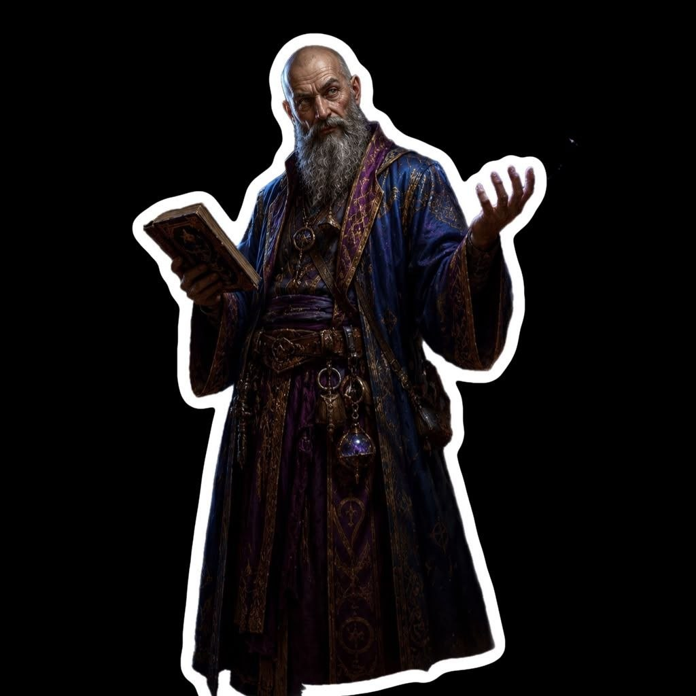

{: .portrait }

# Astorio Wisewind

> *Umano — School of Divination Wizard 10, Mago consulente nell'esercito di Neverwinter*

---

## Background

Fin da bambino, Astorio era tormentato dalle domande. Non gli bastava sapere che una cosa esistesse: voleva comprenderne l'origine, il funzionamento e il motivo della sua esistenza. Mentre gli altri ragazzi sognavano di diventare mercanti, soldati o marinai, lui trascorreva le giornate immerso nei libri e le notti a osservare le stelle, cercando schemi invisibili che sembravano sfuggire a tutti gli altri.

Nato da una famiglia modesta nella **Costa della Spada**, figlio di uno scriba al servizio di un piccolo tempio di **Oghma**, il Signore della Conoscenza, crebbe circondato da pergamene, cronache dimenticate e racconti provenienti da ogni angolo di Faerûn. Fu proprio tra quelle pagine ingiallite che nacque la sua passione per i misteri del passato.

### La Scoperta

A vent'anni ottenne un posto come assistente presso una grande biblioteca di **Neverwinter**. Lì, durante il riordino di antichi documenti recuperati dalle terre selvagge del Nord, si imbatté in alcuni **frammenti di testi netheresi**. Erano poche righe, incomplete e quasi illeggibili, ma bastarono ad accendere una fiamma destinata a consumare il resto della sua vita.

Quei documenti parlavano di antichi arcanisti di **Netheril**, di città volanti scomparse nei cieli migliaia di anni prima e di segreti magici che il mondo moderno aveva ormai dimenticato.

Da quel giorno Astorio consacrò la propria esistenza alla ricerca della conoscenza perduta.

### Quarant'Anni di Ricerca

Per oltre quarant'anni attraversò Faerûn seguendo tracce e leggende. Esplorò rovine sommerse nelle paludi del **Mere of Dead Men**, scalò montagne nelle **Marche d'Argento**, consultò sapienti a **Candlekeep** e cercò antichi manufatti nei deserti di **Anauroch**, là dove un tempo sorgeva il grande impero di Netheril.

Non cercava ricchezze. Non cercava fama. Cercava risposte.

Con il passare degli anni il suo nome divenne noto negli ambienti accademici e arcani. Le sue ricerche gli valsero il rispetto di molti studiosi, ma anche una certa reputazione di eccentrico. Astorio era famoso per abbandonare conferenze prestigiose o incarichi ben retribuiti pur di inseguire una voce, una mappa incompleta o il racconto di un viaggiatore che sosteneva di aver visto qualcosa di impossibile.

### Il Servizio Militare

Purtroppo la conoscenza non sempre riempie le tasche. Dopo decenni di spedizioni costose, biblioteche da finanziare e spedizioni finite nel nulla, il suo patrimonio si prosciugò lentamente.

Così, quando le finanze iniziarono a scarseggiare, Astorio accettò un incarico come **mago consulente nell'esercito di Neverwinter**. Ufficialmente il suo compito è fornire supporto arcano alle truppe. In realtà, egli considera il servizio militare un'opportunità per raggiungere luoghi remoti, rovine dimenticate e misteri che altrimenti rimarrebbero fuori dalla sua portata.

---

## Informazioni Base

| | |
|---|---|
| **Nome completo** | Astorio Wisewind |
| **Razza** | Umano |
| **Classe** | School of Divination Wizard 10 |
| **Background** | Sage (Astronomer) |
| **Allineamento** | Neutral Good |
| **Età** | 63 anni |
| **Forza** | 13 (+1) |
| **Destrezza** | 16 (+3) |
| **Costituzione** | 14 (+2) |
| **Intelligenza** | 18 (+4) |
| **Saggezza** | 18 (+4) |
| **Carisma** | 16 (+3) |

---

## Statistiche

- **PF Massimi:** 52
- **CA:** 13 (16 con *Mage Armor*)
- **Velocità:** 30ft
- **Iniziativa:** +3
- **Bonus di Competenza:** +4
- **Saggezza Passiva (Percezione):** 14

### Tiri Salvezza
| | |
|---|---|
| **Forza** | +1 |
| **Destrezza** | +3 |
| **Costituzione** | +2 |
| **Intelligenza** | +8 |
| **Saggezza** | +8 |
| **Carisma** | +3 |

### Abilità
Arcano +8, Storia +8, Intuizione +8, Indagare +8, Percezione +4, Religione +4, Medicina +4, Natura +4, Sopravvivenza +4

### Linguaggi
Abissale, Celestiale, Comune, Elfico

### Competenze
Armi: Dagger, Dart, Light Crossbow, Quarterstaff, Sling

---

## Privilegi e Tratti

### Tratti Razziali (Umano)
- **Bonus Feat** — Talento aggiuntivo al 1° livello.
- **Skill Proficiency** — Competenza in un'abilità aggiuntiva.

### Wizard (School of Divination 10)
- **Ritual Casting** — Può lanciare come rituale qualsiasi incantesimo con il taglio *ritual* preparato nel suo spellbook.
- **Arcane Recovery** — Una volta al giorno, dopo un riposo breve, recupera slot incantesimo per un livello combinato pari alla metà del suo livello da mago (arrotondato per eccesso: 5). Nessuno slot può essere di 6° livello o superiore.
- **Cantrip Formulas** — Dopo un riposo lungo, può sostituire un trucchetto da mago con un altro dal suo spellbook.
- **Divination Savant** — Tempo e costo per copiare incantesimi di divinazione nello spellbook sono dimezzati.
- **Portent** — Dopo un riposo lungo, tira due d20 e registra i risultati. Può sostituire qualsiasi tiro per colpire, tiro salvezza o prova di caratteristica di una creatura che può vedere con uno di questi numeri, prima del tiro. Ogni dado può essere usato una sola volta.
- **Expert Divination** — Quando lancia un incantesimo di divinazione di 2° livello o superiore, recupera uno slot incantesimo speso di livello inferiore (massimo 5°).
- **The Third Eye** — Usando un'azione, può ottenere uno dei seguenti benefici fino a quando non viene incapacitato o non termina un riposo:
    - **Darkvision** — 60ft.
    - **Ethereal Sight** — Vede nel Piano Etereo entro 60ft.
    - **Greater Comprehension** — Legge qualsiasi lingua.
    - **See Invisibility** — Vede creature e oggetti invisibili entro 10ft.

### Researcher (Sage)
Quando tenta di apprendere o ricordare informazioni, se non le conosce, sa quasi sempre dove e da chi può ottenerle.

### Talento: War Caster
- Vantaggio sui tiri salvezza di Costituzione per mantenere la concentrazione.
- Può eseguire le componenti somatiche anche con armi o scudo in mano.
- Può lanciare un incantesimo (tempo di lancio 1 azione, che bersagli solo quella creatura) come attacco di opportunità invece di un attacco in mischia.

---

## Attacchi

| Attacco | Bonus | Danno | Tipo |
|---|---|---|---|
| **Chill Touch** (cantrip) | +8 | 2d8 | Necrotic |
| **Ray of Frost** (cantrip) | +8 | 2d8 | Cold |
| **Frostbite** (cantrip) | DC 16 | 2d6 | Cold |
| **Dagger** | +7 | 1d4+3 | Perforante |
| **Ice Knife** (1°) | DC 16 | 1d10 Perf. + 2d6 Cold | — |
| **Shatter** (2°) | DC 16 | 3d8 | Thunder |
| **Fireball** (3°) | DC 16 | 8d6 | Fire |
| **Blight** (4°) | DC 16 | 8d8 | Necrotic |
| **Ice Storm** (4°) | DC 16 | 2d8 Cont. + 4d6 Cold | — |
| **Wall of Fire** (4°) | DC 16 | 5d8 | Fire |
| **Cloudkill** (5°) | DC 16 | 5d8 | Poison |
| **Wall of Light** (5°) | +8 | 4d8 | Radiant |

**CD Tiro Salvezza:** 16 | **Bonus Attacco Incantesimo:** +8

---

## Incantesimi

### Trucchetti (a volontà)
- **Blade Ward** — Resistenza a danni contundenti, perforanti e taglienti da armi per 1 round.
- **Chill Touch** — Mano spettrale: 2d8 necrotici, il bersaglio non può recuperare PF fino al prossimo turno. Se non morto, svantaggio in attacco.
- **Mage Hand** — Mano spettrale per manipolare oggetti (max 10lb) entro 30ft.
- **Frostbite** — 2d6 freddo, svantaggio al prossimo attacco con arma (TS Costituzione).
- **Ray of Frost** — 2d8 freddo, velocità -10ft.

### Livello 1 (4 slot)
- **Detect Magic** (R, D) — Percepisce magia entro 30ft, ne identifica la scuola.
- **Expeditious Retreat** (D) — Azione bonus: azione Dash per 10 minuti.
- **Grease** — Olio viscido in un quadrato di 10ft: TS Destrezza o proni, terreno difficile.
- **Feather Fall** (R) — Rallenta la caduta di 5 creature (60ft/round).
- **Find Familiar** (R) — Evoca un famiglio (gufo, gatto, ecc.) che obbedisce ai comandi.
- **Ice Knife** — Dardo di ghiaccio: 1d10 perforanti + esplosione 2d6 freddo (5ft raggio).

### Livello 2 (3 slot)
- **Shatter** — Risonanza: 3d8 tuono in sfera 10ft. Svantaggio per creature inorganiche.
- **Misty Step** — Azione bonus: teletrasporto 30ft.
- **Darkness** (C) — Oscurità magica 15ft, blocca la visione oscura.

### Livello 3 (3 slot)
- **Counterspell** (R) — Interrompe un incantesimo entro 60ft. 3° o inferiore: automatico. Superiore: prova CD 10 + livello.
- **Fireball** — 8d6 fuoco in sfera 20ft (TS Destrezza metà).
- **Haste** (C) — Velocità raddoppiata, +2 CA, vantaggio TS Destrezza, azione extra.
- **Slow** (C) — Fino a 6 creature in cubo 40ft: velocità dimezzata, -2 CA/TS, azione o bonus action.
- **Dispel Magic** — Termina magie su bersaglio.

### Livello 4 (3 slot)
- **Blight** — 8d8 necrotici (TS Costituzione).
- **Dimension Door** — Teletrasporto: sé + 1 creatura volenterosa, fino a 500ft.
- **Polymorph** (C) — Trasforma una creatura in una bestia (CR ≤ livello/CR).
- **Ice Storm** — 2d8 contundenti + 4d6 freddo (sfera 20ft, cilindro 40ft).
- **Wall of Fire** (C) — Muro di fuoco 60×20ft: 5d8 fuoco a chi lo attraversa o finisce il turno vicino.
- **Greater Invisibility** (C) — Invisibilità per 1 minuto.

### Livello 5 (2 slot)
- **Animate Objects** (C) — Anima fino a 10 oggetti (600lb) che combattono per te.
- **Cloudkill** (C) — Nube 20ft: 5d8 veleno (TS Costituzione), si muove di 10ft/round.
- **Wall of Light** (C) — Muro 60×10ft: 4d8 radianti, acceca 1 minuto, raggio come azione.
- **Wall of Stone** (C) — Muro di pietra (10 pannelli 10×10ft), permanente se concentrazione 10 minuti.
- **Teleportation Circle** — Cerchio di teletrasporto permanente (dopo 1 anno di lanci giornalieri).
- **Bigby's Hand** (C) — Mano di forza: pugno (4d8 forza), spinta, presa, scudo.

---

## Equipaggiamento

- Arcane Focus (amuleto viola)
- Spellbook (grimorio antico)
- Dagger
- Explorer's Pack (zaino, sacco a pelo, kit da pasto, esca, 10 torce, 10 razioni, corda di canapa)
- Ink & Quill
- Letter from a Dead Colleague (domanda ancora senza risposta)
- Belt Pouch
- 10 GP

---

## Tratti Caratteriali

- Curioso fino all'ossessione. Gentile e paziente, ma spesso distratto dai propri pensieri.
- Considera ogni persona una possibile fonte di conoscenza.
- *"Parlo lentamente quando parlo con idioti. Il che significa… quasi tutti, rispetto a me. Sono abituato ad aiutare chi non è intelligente quanto me, e spiego pazientemente qualsiasi cosa a chiunque."*

### Ideali
**Bellezza** — Ciò che è bello ci indica qualcosa che va oltre sé stesso, verso ciò che è vero. (Buono) La conoscenza è la più alta forma di bellezza.

### Legami
*"Passo tutta la vita a cercare la risposta a una domanda che non ho ancora trovato."* — I frammenti netheresi letti da giovane a Neverwinter rimangono il mistero che lo spinge avanti.

### Difetti
Quando si trova davanti a un mistero irrisolto o a una scoperta che potrebbe ampliare la sua conoscenza, Astorio perde ogni senso della prudenza. Per lui non esiste porta che non debba essere aperta, tomo che non debba essere letto o rovina che non debba essere esplorata, qualunque sia il prezzo da pagare.

Tende inoltre a trascurare soluzioni ovvie in favore di quelle complicate — perché *complicato* è spesso più interessante.