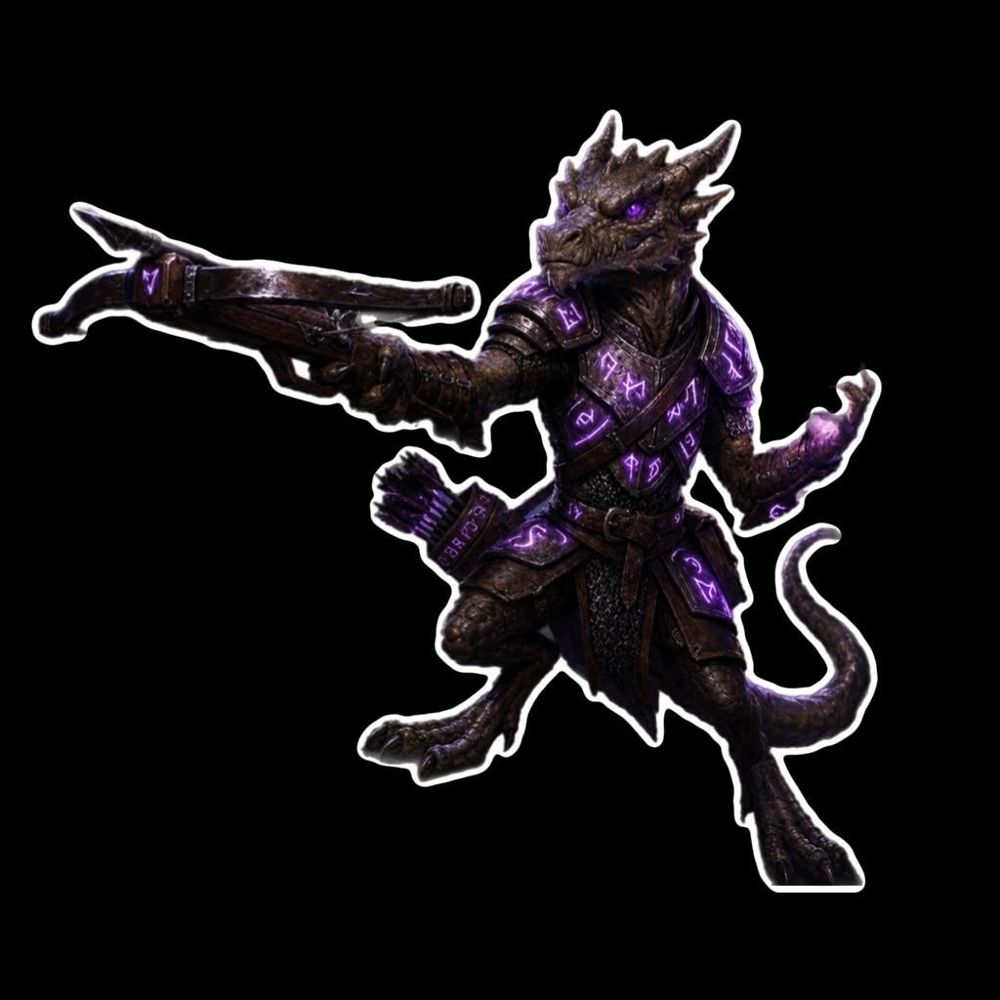

{: .portrait }

# Kobrut

> *Kobold Psi Warrior, Cavaliere di nobile casata*

---

## Background

Kobrut è il figlio di **Kobrot**, re di una delle più grandi tribù di Koboldi. Grazie a questa discendenza, ha sempre vissuto una vita agiata da principe, viaggiando il mondo come ambasciatore del suo popolo.

Insieme a lui viaggiavano i suoi 3 servitori: **Kobrit**, **Kobrat** e **Franco**. Kobrut si fidava di loro e cercava di trattarli come amici, ma loro erano invidiosi del suo status.

Accortisi che nel resto del mondo tutti i Koboldi sembravano uguali l'uno all'altro, decisero di abbandonarlo rubandogli le vesti e i documenti che ne attestavano l'identità come principe dei Koboldi. Lo tradirono durante una visita a **Neverwinter**, rubandogli l'identità e scappando mentre lui ancora dormiva.

Una volta svegliatosi, Kobrut si ritrovò da solo, senza soldi e senza documenti in una città dove nessuno credeva alla sua storia. Il re di Neverwinter lo assoldò nella guardia cittadina promettendo di cercare i ladri — ma non fece mai nulla, credendo fosse un poveraccio che si inventava storie.

Kobrut accettò l'incarico, ma **non ha mai smesso di raccontare la sua verità** e ha giurato vendetta verso Kobrit, Kobrat e soprattutto l'infame **Franco**.

---

## Informazioni Base

| | |
|---|---|
| **Razza** | Kobold |
| **Classe** | Psi Warrior Fighter 10 |
| **Background** | Knight (Nobile) |
| **Allineamento** | Neutral |
| **Forza** | 12 (+1) |
| **Destrezza** | 20 (+5) |
| **Costituzione** | 16 (+3) |
| **Intelligenza** | 18 (+4) |
| **Saggezza** | 14 (+2) |
| **Carisma** | 14 (+2) |

---

## Tratti Caratteriali

*"Nessuno potrebbe dubitare, guardando il mio portamento regale, che io sia un gradino sopra le masse incolte. Mi prendo grande cura di apparire sempre al meglio e seguire le mode più recenti."*

### Ideali
**Noble Obligation (Good)** — È mio dovere proteggere e prendermi cura delle persone al di sotto di me.

### Legami
*"La gente comune deve vedermi come un eroe del popolo."*

### Difetti
Nascondo un segreto davvero scandaloso che potrebbe rovinare la mia famiglia per sempre.

---

## Privilegi e Tratti di Classe

### Fighter
- **Second Wind** — Azione bonus, recupera 1d10 + livello PF. Una volta per riposo breve/lungo.
- **Dueling** — +2 ai danni con arma da mischia in una mano e nessun'altra arma.
- **Action Surge** — Azione extra in un turno. Una volta per riposo breve/lungo.
- **Extra Attack** — Due attacchi per azione Attacco.
- **Indomitable** — Rilancia un tiro salvezza fallito. Una volta per riposo lungo.

### Psi Warrior
- **Psionic Power** — 12 dadi di Energia Psionica (d8 al livello 10). Poteri:
    - **Protective Field** (reazione) — Riduce il danno subito da una creatura entro 30ft del dado + modificatore Intelligenza.
    - **Psionic Strike** — Danni da forza extra (dado + Intelligenza) dopo un colpo andato a segno.
    - **Telekinetic Movement** — Azione: muove un oggetto o creatura volenterosa di 30ft.
- **Telekinetic Adept** (livello 7):
    - **Psi-Powered Leap** — Azione bonus: ottiene volo pari a 2× velocità fino a fine turno.
    - **Telekinetic Thrust** — Quando danneggia con Psionic Strike, può atterrare o spostare il bersaglio di 10ft (TS Forza).
- **Guarded Mind** (livello 10) — Resistenza ai danni psichici. Se inizia il turno *charmato* o *spaventato*, può spendere un dado per terminare l'effetto.

### Talenti
- **Crossbow Expert** — Ignora il tratto *loading* delle balestre. Nessuno svantaggio in mischia con armi a distanza. Attacco con Hand Crossbow come azione bonus.
- **Sharpshooter** — Nessuno svantaggio per gittata lunga. Ignora *half cover* e *three-quarters cover*. -5/+10 ai danni.

### Tratti Razziali (Kobold)
- **Darkvision** 60ft
- **Draconic Cry** — Azione bonus: grido che dà vantaggio agli alleati contro nemici entro 10ft. Usi pari a bonus di competenza (4). Recupero: riposo lungo.
- **Kobold Legacy (Craftiness)** — Competenza in una abilità a scelta (Investigazione).

---

## Attacchi

| Arma | Bonus | Danno | Tipo |
|---|---|---|---|
| **Heavy Crossbow +1** | +12 | 1d10+5 | Perforante |
| **Longbow** | +11 | 1d8+5 | Perforante |
| **Hand Crossbow** | +11 | 1d6+5 | Perforante |
| **Rapier** | +9 | 1d8+5 | Perforante |

---

## Equipaggiamento

- Heavy Crossbow +1
- Shield of Missile Attraction
- Studded Leather Armor
- Longbow + 20 Frecce
- Rapier
- Hand Crossbow + 20 Bolzoni
- Shield
- Dungeoneer's Pack
- Fine Clothes
- Signet Ring
- 25 GP
- 1 Scroll of Pedigree

---

## Servitori (Retainers)

In quanto Cavaliere, Kobrut ha il servizio di tre **retainers** fedeli alla sua famiglia. Uno di questi è un **nobile** che funge da suo scudiero; gli altri possono includere un palafreniere e un servitore che lucida l'armatura. Non combattono, non seguono in dungeon, e se tenuti in pericolo se ne vanno.

---

## Statistiche

- **PF Massimi:** 93
- **CA:** 19 (19 con Shield of Missile Attraction)
- **Velocità:** 30ft
- **Iniziativa:** +5
- **Bonus di Competenza:** +4
- **Saggezza Passiva (Percezione):** 12

### Tiri Salvezza
| | |
|---|---|
| **Forza** | +5 |
| **Destrezza** | +9 |
| **Costituzione** | +7 |
| **Intelligenza** | +4 |
| **Saggezza** | +2 |
| **Carisma** | +2 |

### Abilità
Acrobazia +9, Atletica +5, Furtività +5, Indagare +4, Intrattenere +2, Intuizione +2, Medicina +6, Percezione +2, Persuasione +6, Rapidità di Mano +5, Religione +4, Sopravvivenza +2, Storia +8

### Linguaggi
Common, Draconic, Goblin

### Competenze
Armature: leggere, medie, pesanti, scudi
Armi: marziali, semplici, Hand Crossbow